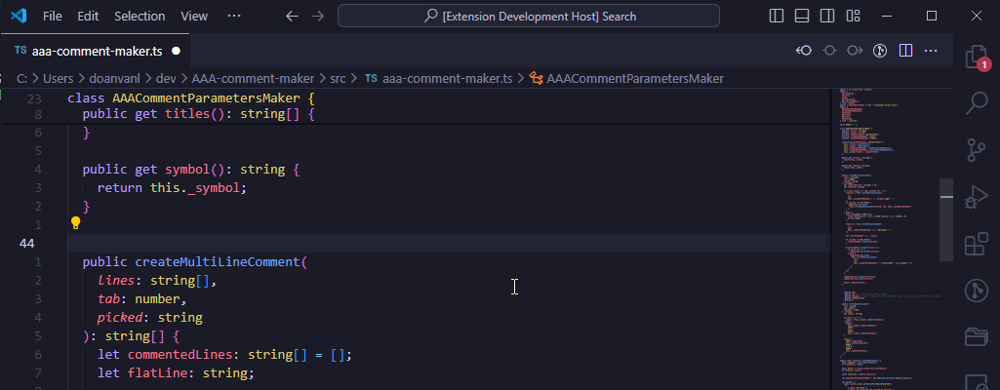
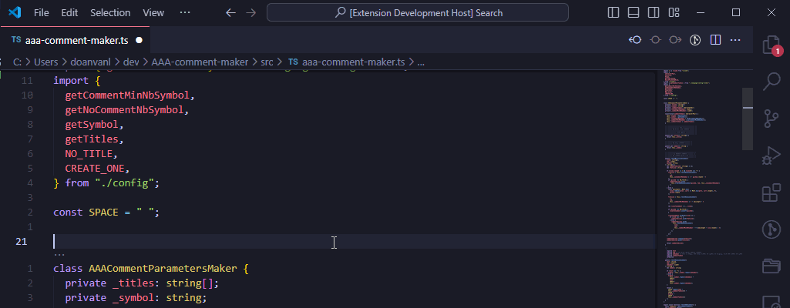

# AAA-comment-maker

## Features

This extensions provides comment maker with customizable titles for the selected lines

### Demo : Only title

## Extension Settings

This extension contributes the following settings:

- `aaaCommentMaker.symbol`: Symbol used to fill created comments (default to `"="`).
- `aaaCommentMaker.noCommentNbSymbol`: Number of symbols around title when only title is used (default to `8`).
- `aaaCommentMaker.commentMinNbSymbol`: Minimum number of symbols around title when comment is not empty (default to `6`).
- `aaaCommentMaker.commentMinNbSymbol`: Titles offered in picker (default to `["Arrange", "Act", "Assert"]`).

## Known Issues

N/A

## Release Notes

### 1.0.3

- Indentation problem when multiple lines were selected fixed

### 1.0.2

- Removing trailing blank for one line comment token

### 1.0.1

- Indentation will not be computed, but taken from the first selected line

### 1.0.0

Initial release of AAA Comment Maker
